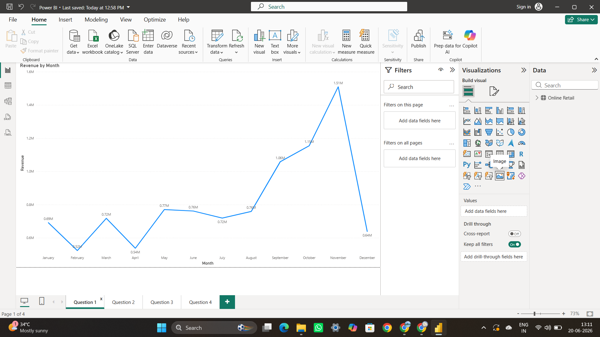
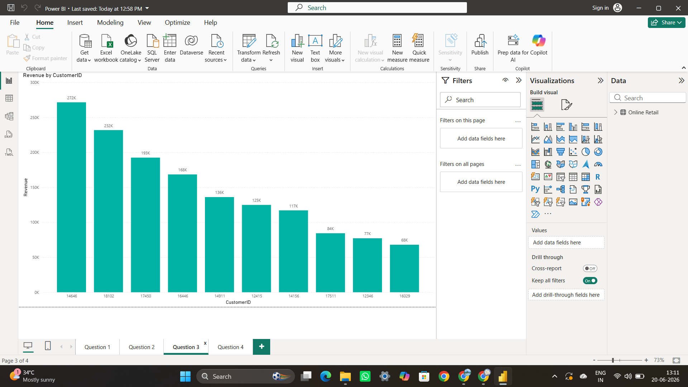
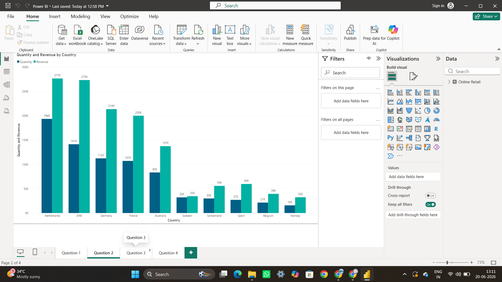
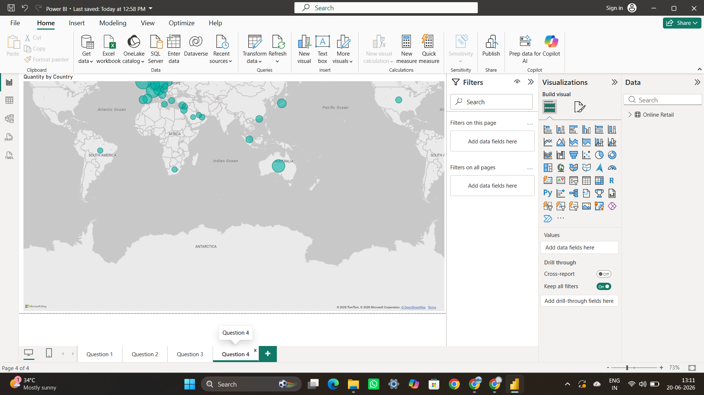

# Online Retail Sales Dashboard (Power BI)

## Overview

This project focuses on analyzing online retail sales data using Microsoft Power BI to uncover business insights, sales trends, customer purchasing behavior, and geographic performance.

The dashboard was designed to help stakeholders monitor revenue growth, identify top-performing customers, and evaluate country-wise sales performance through interactive visualizations.

---

## Business Objectives

- Analyze monthly revenue trends
- Identify top revenue-generating customers
- Compare sales performance across countries
- Visualize global sales distribution
- Generate actionable business insights
- Build an interactive Power BI dashboard

---

## Dataset Information

The dataset contains transactional retail sales records including:

- Invoice Details
- Customer ID
- Product Information
- Quantity Sold
- Unit Price
- Revenue
- Country
- Transaction Date

Dataset Source:
Online Retail Sales Dataset

---

## Dashboard Visualizations

### 1. Monthly Revenue Trend

Tracks revenue performance across different months and identifies seasonal sales patterns.

**Insight:**
Revenue peaked during November, indicating strong year-end customer demand.

---

### 2. Country-wise Sales Analysis

Compares total quantity sold and revenue generated across different countries.

**Insight:**
Netherlands, EIRE, Germany, and France contributed significantly to overall revenue.

---

### 3. Top Customers by Revenue

Identifies high-value customers based on total revenue contribution.

**Insight:**
A small group of customers generated a large portion of overall sales revenue.

---

### 4. Global Sales Distribution

Interactive map visualization showing geographic sales distribution.

**Insight:**
Sales activity was concentrated in Europe, with additional contributions from Asia, Australia, Africa, and South America.

---

## Key Business Insights

- November generated the highest monthly revenue.
- European countries contributed the majority of total sales.
- Customer purchasing behavior follows a Pareto distribution where a small percentage of customers generate significant revenue.
- Geographic analysis highlights major sales regions and potential expansion opportunities.

---

## Tools & Technologies

- Microsoft Power BI
- Microsoft Excel
- Data Cleaning
- Data Visualization
- Business Intelligence
- Dashboard Design

---

## Skills Demonstrated

- Power BI Dashboard Development
- Business Analytics
- Sales Analytics
- KPI Reporting
- Data Cleaning
- Data Modeling
- Data Visualization
- Customer Analytics
- Geographic Analysis
- Insight Generation

---

## Repository Structure

```text
online-retail-sales-dashboard/
│
├── dataset/
│   └── Online Retail.xlsx
│
├── screenshots/
│   ├── monthly-revenue-trend.png
│   ├── country-wise-sales-analysis.png
│   ├── top-customers-revenue.png
│   └── global-sales-distribution.png
│
├── Power BI.pbix
├── README.md
└── LICENSE
```

---

## Dashboard Screenshots

### Monthly Revenue Trend



---

### Country-wise Sales Analysis



---

### Top Customers by Revenue



---

### Global Sales Distribution



---

## Author

**Syed Shahed**

AI & Data Science Engineer

GitHub:
https://github.com/Syed-SS

LinkedIn:
https://www.linkedin.com/in/syedshahed-ai
